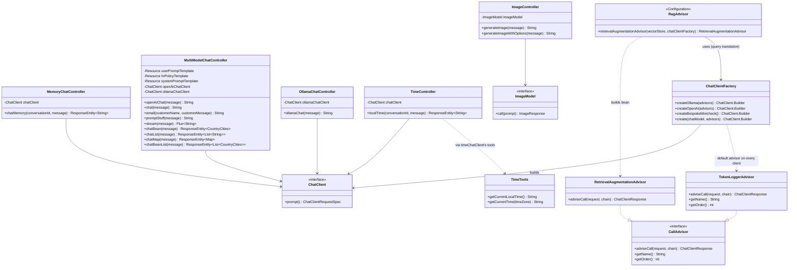

# Chat controllers &amp; advisors — class diagram

Structure of five representative REST controllers, the two cross-cutting advisors
(`TokenLoggerAdvisor`, `RagAdvisor`), and the shared infrastructure (`ChatClientFactory`,
`ChatClient`) they're built on (see
[ai-controllers-advisors-sequence.md](./ai-controllers-advisors-sequence.md) for the runtime
call order).

## Relevant classes

| Class | Source |
|---|---|
| `ImageController` | `ImageController.java` |
| `MemoryChatController` | `MemoryChatController.java` |
| `MultiModelChatController` | `MultiModelChatController.java` |
| `OllamaChatController` | `OllamaChatController.java` |
| `TimeController` | `TimeController.java` |
| `TokenLoggerAdvisor` | `TokenLoggerAdvisor.java` |
| `RagAdvisor` | `RagAdvisor.java` |
| `ChatClientFactory` | `ChatClientFactory.java` |
| `ChatClient` / `CallAdvisor` / `ImageModel` / `RetrievalAugmentationAdvisor` | Spring AI |
| `TimeTools` | `TimeTools.java` |

**Note:** `RetrievalAugmentationAdvisor` (built by `RagAdvisor`) is only wired into the
`ragMemoryChatClient` bean, used by `RagController` — none of the five controllers here go
through it. `TokenLoggerAdvisor`, on the other hand, is registered by `ChatClientFactory` on
every client it builds, so it wraps calls from all five.
