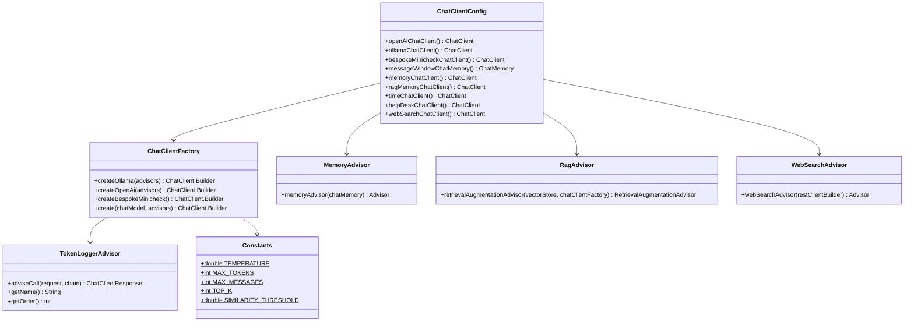

# ChatClient / advisor architecture — class diagram

How `ChatClientConfig` wires together `ChatClientFactory` and the advisor factories to produce
each `ChatClient` bean (see [overall-architecture.md](./overall-architecture.md) for the
runtime request flow).

## Relevant classes

| Class | Source |
|---|---|
| `ChatClientFactory` | `ChatClientFactory.java` |
| `ChatClientConfig` | `ChatClientConfig.java` |
| `MemoryAdvisor` | `MemoryAdvisor.java` |
| `RagAdvisor` | `RagAdvisor.java` |
| `WebSearchAdvisor` | `WebSearchAdvisor.java` |
| `TokenLoggerAdvisor` | `TokenLoggerAdvisor.java` |
| `Constants` | `Constants.java` |
