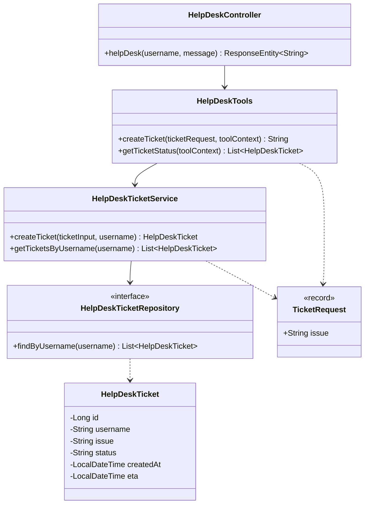

# Help-desk subsystem — class diagram

Structure of the classes involved in ticket creation and lookup, as used by the help-desk tool
calling flow (see [helpdesk-sequence.md](./helpdesk-sequence.md)).

## Relevant classes

| Class | Source |
|---|---|
| `HelpDeskController` | `HelpDeskController.java` |
| `HelpDeskTools` | `HelpDeskTools.java` |
| `HelpDeskTicketService` | `HelpDeskTicketService.java` |
| `HelpDeskTicketRepository` | `HelpDeskTicketRepository.java` |
| `HelpDeskTicket` | `HelpDeskTicket.java` |
| `TicketRequest` | `TicketRequest.java` |
