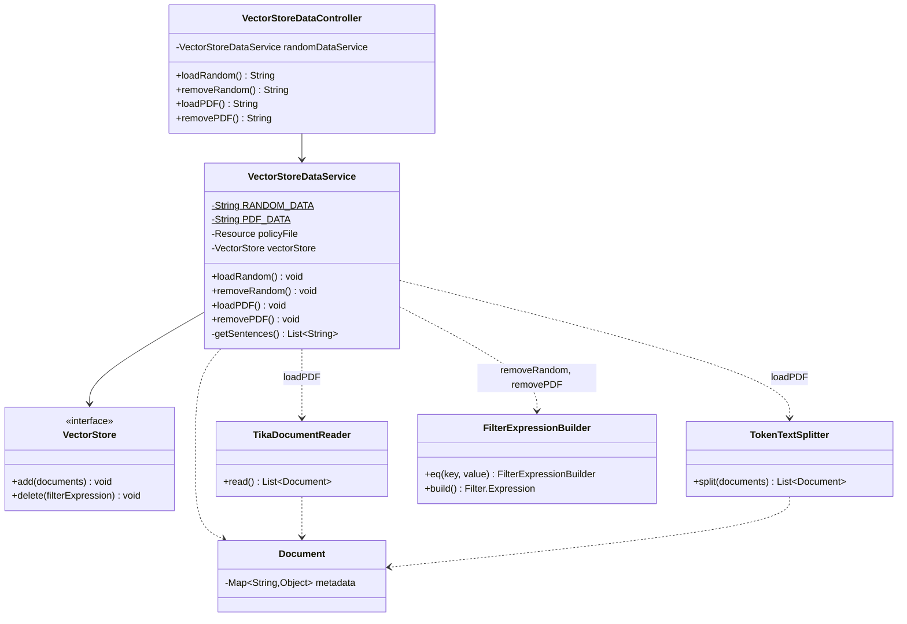

# Vector store data loading — class diagram

Structure of the classes involved in loading and removing sample data (random sentences and
the HR policies PDF) from the vector store, as used in the on-demand data-loading endpoints
(see [vector-store-data-sequence.md](./vector-store-data-sequence.md)).

## Relevant classes

| Class | Source |
|---|---|
| `VectorStoreDataController` | `VectorStoreDataController.java` |
| `VectorStoreDataService` | `VectorStoreDataService.java` |
| `VectorStore` | Spring AI (`org.springframework.ai.vectorstore.VectorStore`) |
| `Document` | Spring AI (`org.springframework.ai.document.Document`) |
| `TikaDocumentReader` | Spring AI (`org.springframework.ai.reader.tika.TikaDocumentReader`) |
| `TokenTextSplitter` | Spring AI (`org.springframework.ai.transformer.splitter.TokenTextSplitter`) |
| `FilterExpressionBuilder` | Spring AI (`org.springframework.ai.vectorstore.filter.FilterExpressionBuilder`) |
