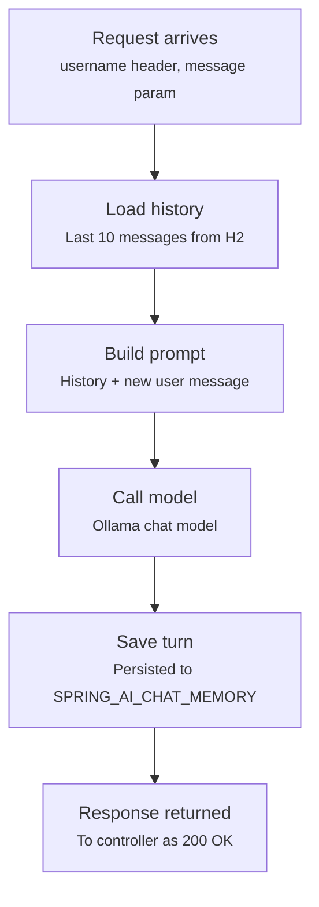

# Chat memory flow

Used by `memoryChatClient` (and any client wrapped with `memoryAdvisor`). The `username` header
becomes the `CONVERSATION_ID`, scoping the JDBC-backed `MessageWindowChatMemory`.

## Relevant classes

| Component | Source |
|---|---|
| Memory advisor factory | `MemoryAdvisor.java` |
| Chat memory bean (window size, repository) | `ChatClientConfig.java#messageWindowChatMemory` |
| Endpoint | `MemoryChatController.java` |
| Backing table schema | `schema-h2db.sql` |
| Max messages constant | `Constants.java` (`MAX_MESSAGES`) |
