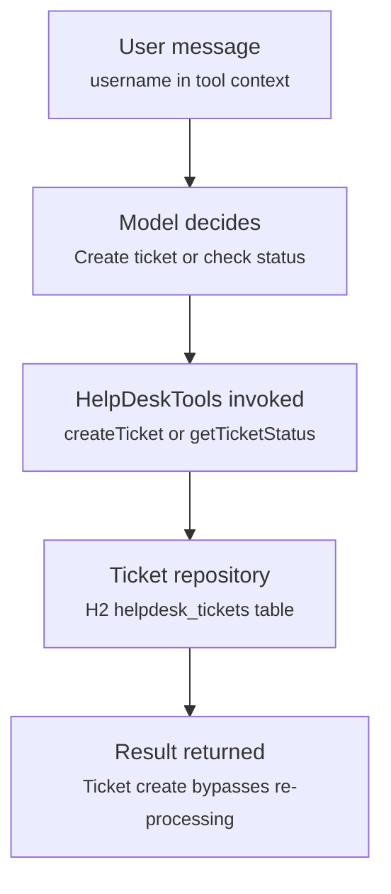

# Help-desk tool calling flow

`HelpDeskController` passes the username into `ToolContext`, and the model decides whether to
invoke `createTicket` (returns directly, bypassing further model processing) or
`getTicketStatus`.

## Relevant classes

| Component | Source |
|---|---|
| Endpoint, tool context wiring | `HelpDeskController.java` |
| Tool definitions | `HelpDeskTools.java` |
| Business logic | `HelpDeskTicketService.java` |
| Persistence | `HelpDeskTicketRepository.java`, `HelpDeskTicket.java` |
| Request payload | `TicketRequest.java` |
| Persona / rules for the assistant | `helpDeskSystemPromptTemplate.st` |

Note: `createTicket` is annotated `returnDirect = true`, so its string result is returned to the
caller as-is instead of being fed back to the model for further processing.
