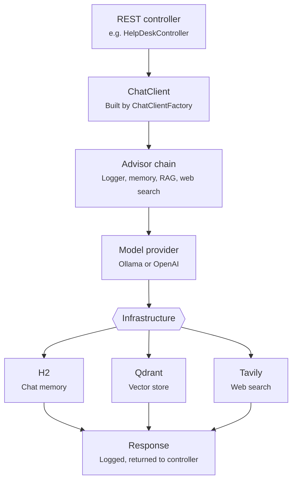

# Overall architecture flow

Every REST controller talks to a `ChatClient` built by `ChatClientFactory`, which wraps the
underlying model (Ollama or OpenAI) with a default advisor chain (logging, token logging, plus
memory/RAG/tools depending on the client bean).

## Relevant classes

| Component | Source |
|---|---|
| Chat client assembly | `ChatClientFactory.java` |
| Client bean wiring | `ChatClientConfig.java` |
| Shared constants (temperature, max tokens) | `Constants.java` |
| Token usage logging | `TokenLoggerAdvisor.java` |
