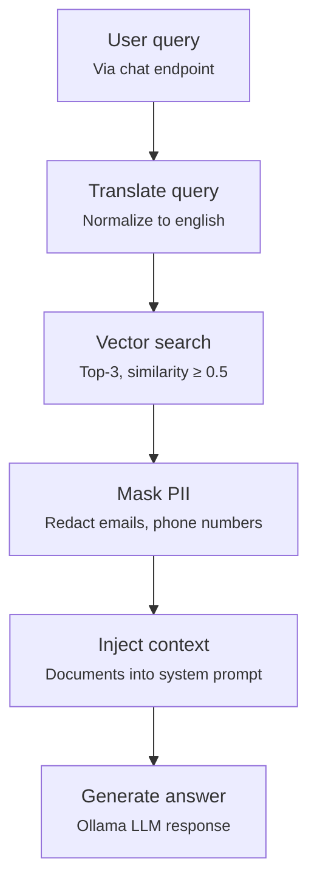

# RAG pipeline flow

This is the flow behind `ragMemoryChatClient` / `RagAdvisor`: a query gets translated, searched
against Qdrant, PII-masked, then injected into the prompt.

## Relevant classes

| Stage | Source |
|---|---|
| Query translation | `TranslationQueryTransformer` (configured in `RagAdvisor.java`) |
| Vector retrieval | `VectorStoreDocumentRetriever` (configured in `RagAdvisor.java`) |
| PII masking | `PIIMaskingDocumentPostProcessor.java` |
| Advisor assembly | `RagAdvisor.java` |
| Manual variant (no advisor) | `RagController.java#randomChat` |
| Similarity / top-K constants | `Constants.java` (`TOP_K`, `SIMILARITY_THRESHOLD`) |
