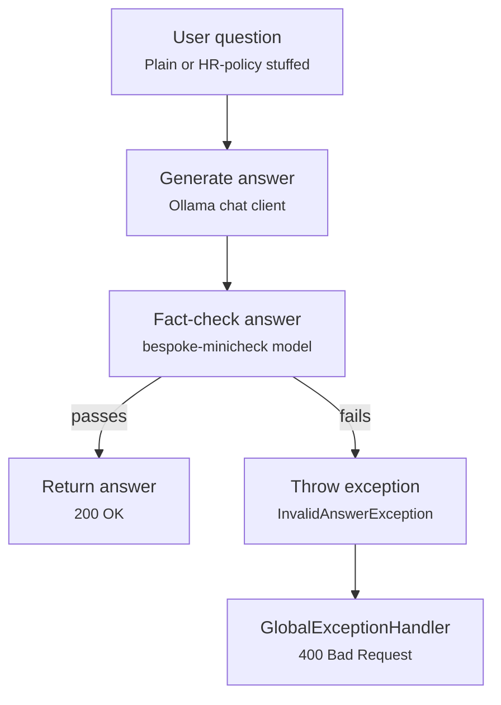

# Self-evaluation / fact-checking flow

`SelfEvaluatingChatController` generates an answer, then re-checks it with
`FactCheckingEvaluator` (backed by the `bespoke-minicheck` model) before deciding whether to
return it or throw `InvalidAnswerException`.

## Relevant classes

| Component | Source |
|---|---|
| Controller, evaluation logic | `SelfEvaluatingChatController.java` |
| Exception thrown on failed evaluation | `InvalidAnswerException.java` |
| Exception → HTTP mapping | `GlobalExceptionHandler.java` |
| Bespoke fact-checking model bean | `ChatClientFactory.java#createBespokeMinicheck`, `ChatClientConfig.java#bespokeMinicheckChatClient` |
| HR context used for prompt-stuffing variant | `hrPolicyTemplate.st` |
