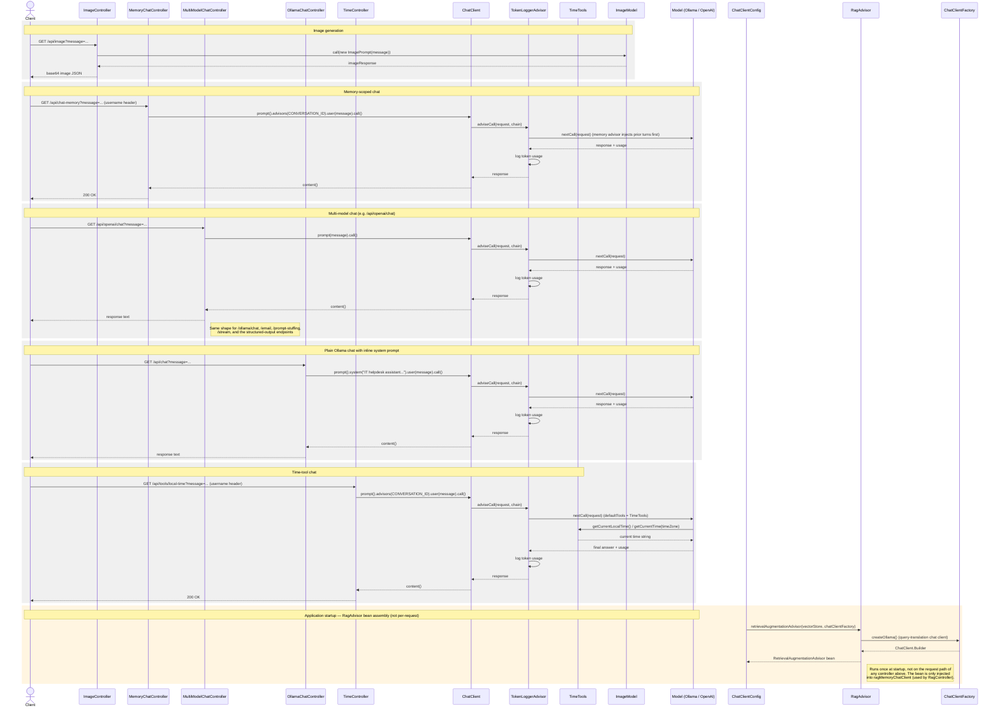

# Chat controllers &amp; advisors — sequence diagram

The call order behind five representative endpoints, showing how `TokenLoggerAdvisor` wraps
every `ChatClient` call, plus a separate startup-time section showing where `RagAdvisor`
actually fits in (see
[ai-controllers-advisors-class-diagram.md](./ai-controllers-advisors-class-diagram.md) for the
static structure).

## Relevant classes

| Participant | Source |
|---|---|
| `ImageController` | `ImageController.java` |
| `MemoryChatController` | `MemoryChatController.java` |
| `MultiModelChatController` | `MultiModelChatController.java` |
| `OllamaChatController` | `OllamaChatController.java` |
| `TimeController` | `TimeController.java` |
| `ChatClient` | Spring AI, beans configured in `ChatClientConfig.java` |
| `TokenLoggerAdvisor` | `TokenLoggerAdvisor.java`, registered by `ChatClientFactory.java` |
| `TimeTools` | `TimeTools.java` |
| `ImageModel` | Spring AI (`org.springframework.ai.image.ImageModel`) |
| `ChatClientConfig` | `ChatClientConfig.java` |
| `RagAdvisor` | `RagAdvisor.java` |
| `ChatClientFactory` | `ChatClientFactory.java` |
