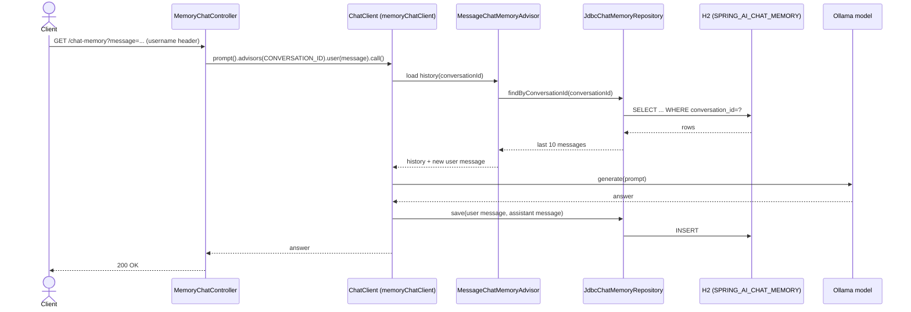

# Chat memory — sequence diagram

The exact call order behind the activity diagram in
[chat-memory.md](./chat-memory.md), including which object calls which.

## Relevant classes

| Participant | Source |
|---|---|
| `MemoryChatController` | `MemoryChatController.java` |
| `ChatClient` (memoryChatClient bean) | `ChatClientConfig.java#memoryChatClient` |
| `MessageChatMemoryAdvisor` | Spring AI, wired via `MemoryAdvisor.java` |
| `JdbcChatMemoryRepository` | Spring AI JDBC chat memory module |
| H2 schema | `schema-h2db.sql` |
