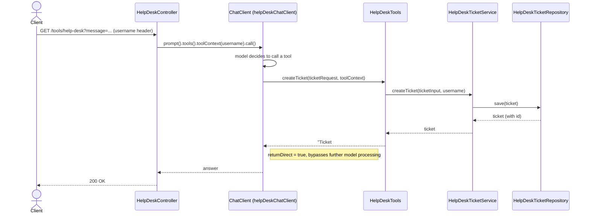

# Help-desk tool calling — sequence diagram

The exact call order behind the activity diagram in
[helpdesk-tool-calling.md](./helpdesk-tool-calling.md), including which object calls which.

## Relevant classes

| Participant | Source |
|---|---|
| `HelpDeskController` | `HelpDeskController.java` |
| `ChatClient` (helpDeskChatClient bean) | `ChatClientConfig.java#helpDeskChatClient` |
| `HelpDeskTools` | `HelpDeskTools.java` |
| `HelpDeskTicketService` | `HelpDeskTicketService.java` |
| `HelpDeskTicketRepository` | `HelpDeskTicketRepository.java` |
