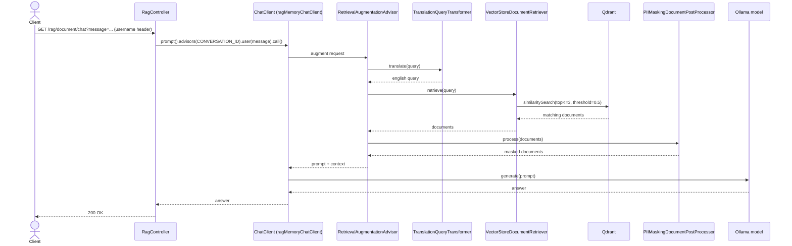

# RAG document chat — sequence diagram

The exact call order behind the activity diagram in
[rag-pipeline.md](./rag-pipeline.md), including which object calls which.

## Relevant classes

| Participant | Source |
|---|---|
| `RagController` | `RagController.java` |
| `ChatClient` (ragMemoryChatClient bean) | `ChatClientConfig.java#ragMemoryChatClient` |
| `RetrievalAugmentationAdvisor` | `RagAdvisor.java` |
| `TranslationQueryTransformer` | Spring AI RAG module, configured in `RagAdvisor.java` |
| `VectorStoreDocumentRetriever` | Spring AI RAG module, configured in `RagAdvisor.java` |
| `PIIMaskingDocumentPostProcessor` | `PIIMaskingDocumentPostProcessor.java` |
