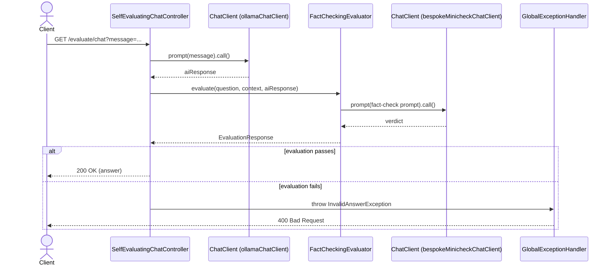

# Self-evaluation / fact-checking — sequence diagram

The exact call order behind the activity diagram in
[self-evaluation.md](./self-evaluation.md), including which object calls which.

## Relevant classes

| Participant | Source |
|---|---|
| `SelfEvaluatingChatController` | `SelfEvaluatingChatController.java` |
| `ChatClient` (ollamaChatClient bean) | `ChatClientConfig.java#ollamaChatClient` |
| `FactCheckingEvaluator` | Spring AI evaluation module |
| `ChatClient` (bespokeMinicheckChatClient bean) | `ChatClientFactory.java#createBespokeMinicheck` |
| `GlobalExceptionHandler` | `GlobalExceptionHandler.java` |
| `InvalidAnswerException` | `InvalidAnswerException.java` |
