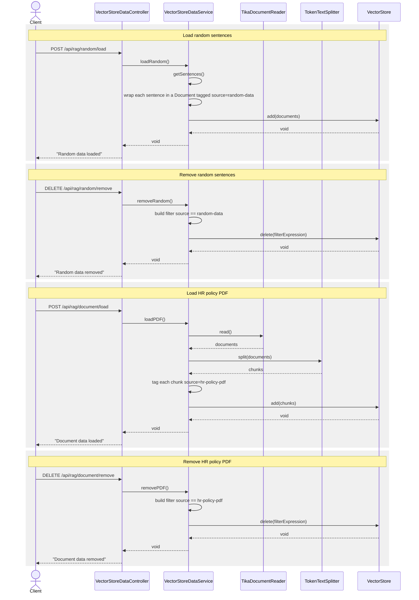

# Vector store data loading — sequence diagram

The exact call order behind the four on-demand data-loading endpoints exposed by
`VectorStoreDataController`, including which object calls which (see
[vector-store-data-class-diagram.md](./vector-store-data-class-diagram.md) for the static
structure).

## Relevant classes

| Participant | Source |
|---|---|
| `VectorStoreDataController` | `VectorStoreDataController.java` |
| `VectorStoreDataService` | `VectorStoreDataService.java` |
| `TikaDocumentReader` | Spring AI (`org.springframework.ai.reader.tika.TikaDocumentReader`) |
| `TokenTextSplitter` | Spring AI (`org.springframework.ai.transformer.splitter.TokenTextSplitter`) |
| `VectorStore` | Spring AI (`org.springframework.ai.vectorstore.VectorStore`) |
