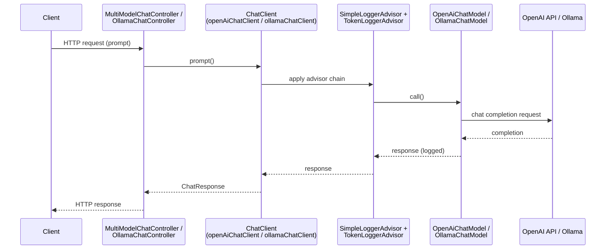
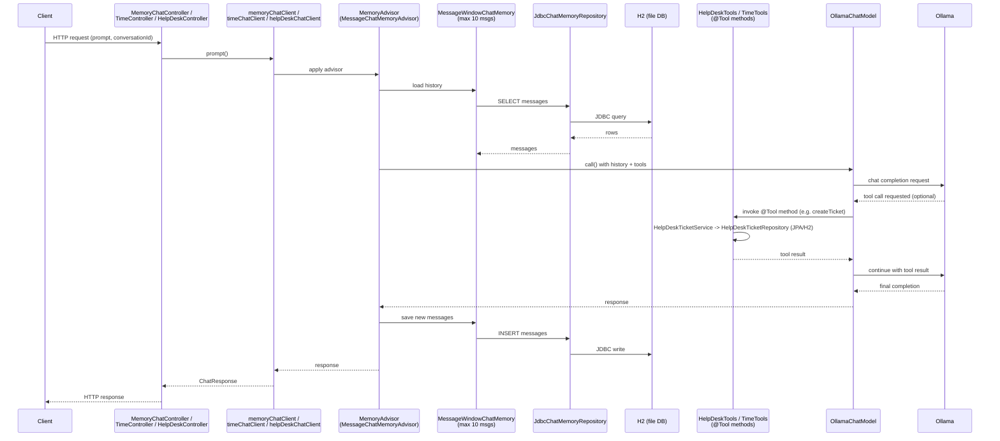
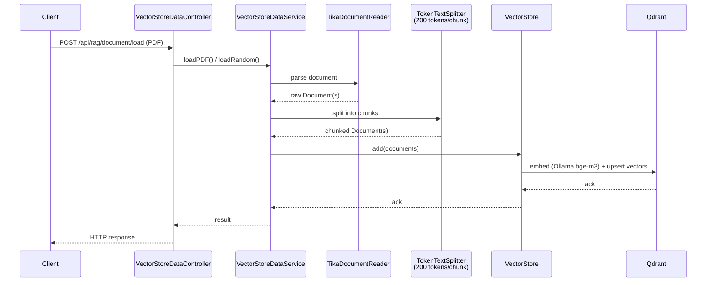
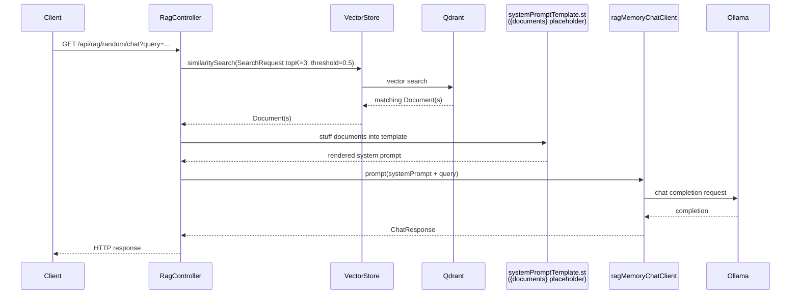
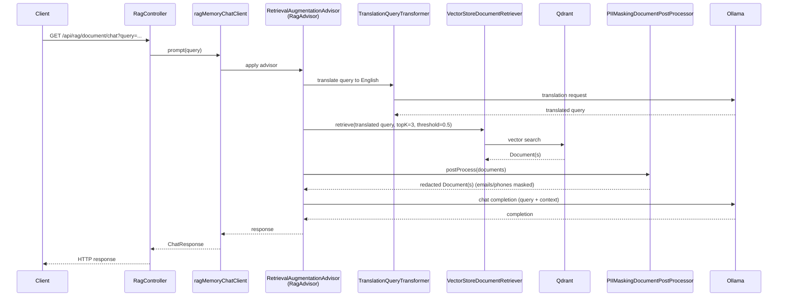
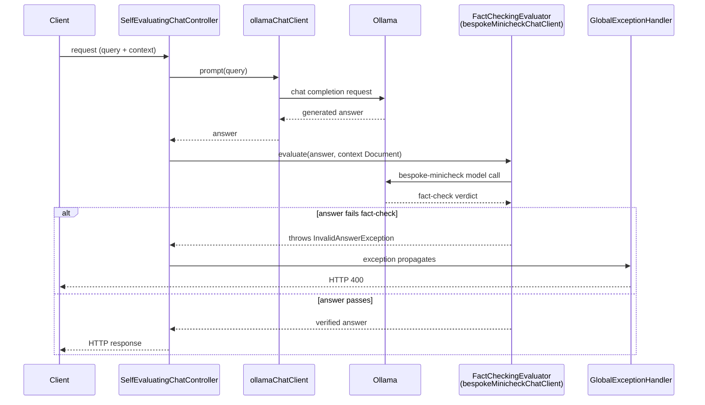
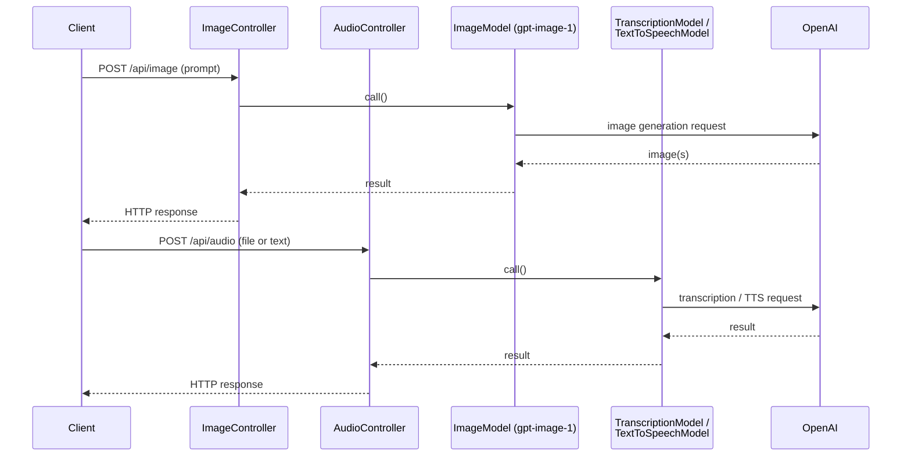

# Runtime Flows

Sequence diagrams for the main request flows in this project. Rendered with [Mermaid](https://mermaid.js.org/) — view directly on GitHub, in VS Code (with a Mermaid preview extension), or in any Markdown viewer that supports it.

Base package: `com.multimodel.llm`. See root `README.md` for the endpoint table and general architecture.

## 1. Plain chat

`MultiModelChatController` (`/api/openai/chat`, `/api/ollama/chat`, `/api/stream`, ...) or `OllamaChatController` (`/api/chat`).



`ChatClientConfig` builds these clients via `ChatClientFactory.createOpenAi(...)` / `createOllama(...)`, which attaches the default `SimpleLoggerAdvisor` + `TokenLoggerAdvisor` pair.

## 2. Memory chat (with tool calling)

`MemoryChatController` (`/api/chat-memory`), `TimeController` (`/api/tools/local-time`), `HelpDeskController` (`/api/tools/help-desk`).



Tool methods use `ToolContext` to access the current username. `HelpDeskTools.createTicket` / `getTicketStatus` delegate to `HelpDeskTicketService` → `HelpDeskTicketRepository`.

## 3. RAG — ingestion

`VectorStoreDataController` (`POST/DELETE /api/rag/random/load|remove`, `/document/load|remove`).



## 4. RAG — retrieval

Two retrieval paths exist side by side.

**4a. Manual retrieval** — `RagController.randomChat` (`GET /api/rag/random/chat`)



**4b. Advisor-driven retrieval** — `RagController.documentChat` (`GET /api/rag/document/chat`)



## 5. Web-search RAG

`RagController.webSearchChat` (`GET /api/rag/web-search/chat`).

```mermaid
sequenceDiagram
    participant Client
    participant Controller as RagController
    participant ChatClient as webSearchChatClient
    participant WSA as WebSearchAdvisor
    participant RAA as RetrievalAugmentationAdvisor
    participant Retriever as TavilyWebSearchDocumentRetriever<br/>(active; Firecrawl variant present but disabled)
    participant Tavily as Tavily Search API
    participant Ollama

    Client->>Controller: GET /api/rag/web-search/chat?query=...
    Controller->>ChatClient: prompt(query)
    ChatClient->>WSA: apply advisor
    WSA->>RAA: delegate to RetrievalAugmentationAdvisor
    RAA->>Retriever: retrieve(query)
    Retriever->>Tavily: POST /search (bearer TAVILY_SEARCH_API_KEY)
    Tavily-->>Retriever: search results
    Retriever-->>RAA: mapped Document(s)
    RAA->>Ollama: chat completion (query + web context)
    Ollama-->>RAA: completion
    RAA-->>ChatClient: response
    ChatClient-->>Controller: ChatResponse
    Controller-->>Client: HTTP response
```

> `FirecrawlWebSearchDocumentRetriever` (`https://api.firecrawl.dev/v1/search`, `FIRECRAWL_API_KEY`) implements the same retriever contract but is currently commented out in `WebSearchAdvisor` in favor of Tavily.

## 6. Self-evaluation (fact-checking)

`SelfEvaluatingChatController` (`/api/evaluate/chat`, `/prompt-stuffing`).



## 7. Image / Audio (simple passthrough)



---

**Key files by flow:**

| Flow | Files |
|---|---|
| Plain chat | `controller/MultiModelChatController.java`, `controller/OllamaChatController.java`, `config/ChatClientConfig.java`, `config/ChatClientFactory.java`, `advisors/TokenLoggerAdvisor.java` |
| Memory chat | `controller/MemoryChatController.java`, `controller/TimeController.java`, `controller/HelpDeskController.java`, `advisors/MemoryAdvisor.java`, `tools/HelpDeskTools.java`, `tools/TimeTools.java`, `service/HelpDeskTicketService.java` |
| RAG ingestion | `controller/VectorStoreDataController.java`, `service/VectorStoreDataService.java` |
| RAG retrieval | `controller/RagController.java`, `advisors/RagAdvisor.java`, `rag/PIIMaskingDocumentPostProcessor.java` |
| Web-search RAG | `controller/RagController.java`, `advisors/WebSearchAdvisor.java`, `rag/TavilyWebSearchDocumentRetriever.java`, `rag/FirecrawlWebSearchDocumentRetriever.java` |
| Self-evaluation | `controller/SelfEvaluatingChatController.java`, `exception/GlobalExceptionHandler.java`, `exception/InvalidAnswerException.java` |
| Image/Audio | `controller/ImageController.java`, `controller/AudioController.java` |
